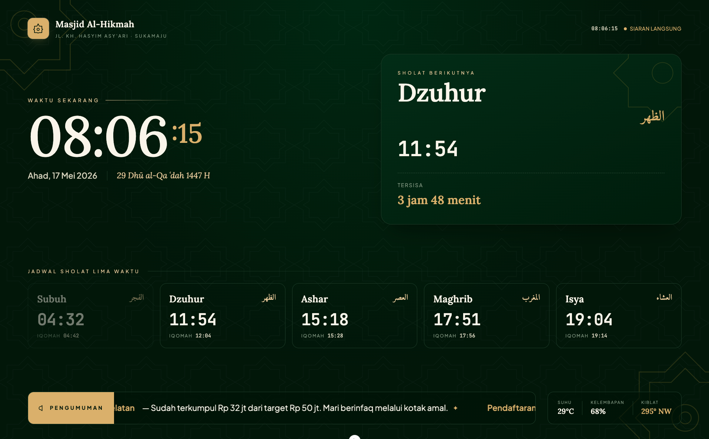
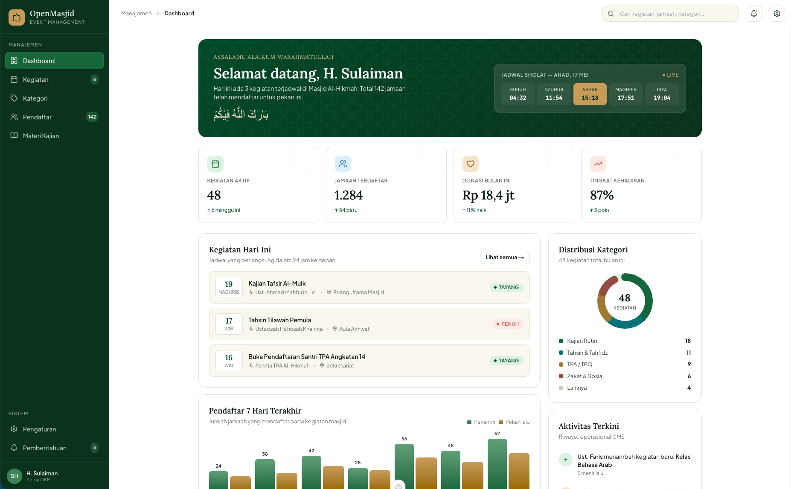
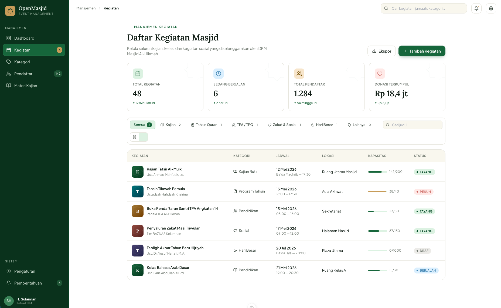
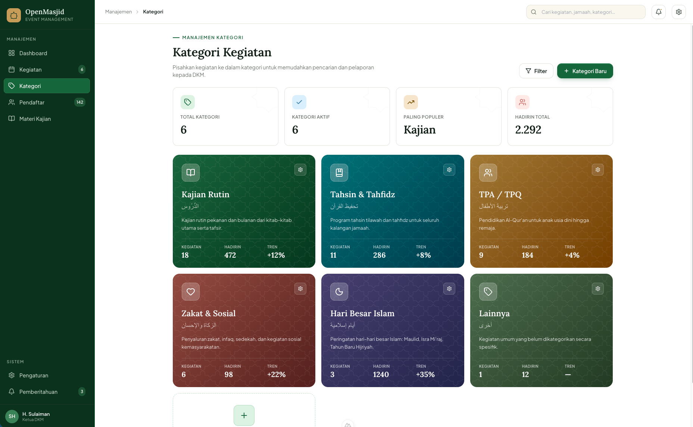
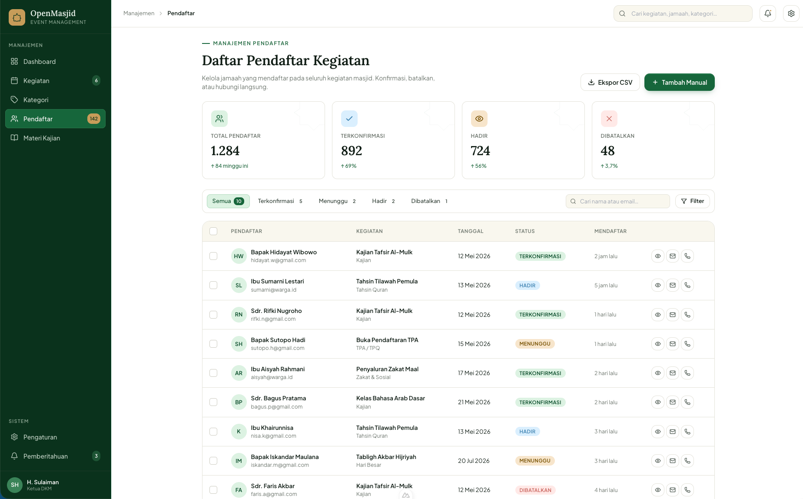
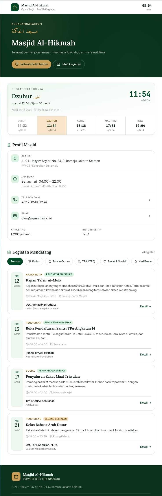

# OpenMasjid

> Platform digital terpadu untuk DKM (Dewan Kemakmuran Masjid) — satu aplikasi untuk mengelola profil masjid, jadwal sholat, kegiatan kajian, pendaftaran jamaah, hingga tampilan layar TV di ruang utama.

OpenMasjid menggabungkan tiga permukaan utama dalam satu codebase:

1. **Portal Jamaah** — halaman publik berisi profil masjid, jadwal sholat, dan daftar kegiatan yang dapat diikuti.
2. **CMS Admin (DKM)** — dashboard pengelolaan kegiatan, pendaftar, kategori, dan pengaturan masjid.
3. **TV Display** — tampilan layar besar untuk ruang sholat yang menampilkan jam, jadwal sholat, hitung mundur waktu sholat berikutnya, dan running text pengumuman.

Dibangun dengan **Nuxt 4 + Vue 3 + TailwindCSS**, didukung **PostgreSQL** (via Drizzle ORM) dan **Supabase** untuk auth & storage.

---

## Fitur Utama

### Portal Jamaah (Public)
- Profil masjid: nama, alamat, jam operasional, kapasitas, jadwal Jumat.
- Jadwal sholat harian berbasis library [`adhan`](https://github.com/batoulapps/adhan-js) dengan tampilan **next prayer countdown**.
- Tanggal Hijriyah otomatis (via `hijri-js`) berdampingan dengan tanggal Masehi.
- Daftar kegiatan publik dengan filter kategori (Kajian, Tahsin, TPA, Zakat, Muharram, Umum).
- Status pendaftaran real-time: *Pendaftaran dibuka · Sedang berjalan · Kuota penuh · Akan datang*.

### CMS Admin
- **Dashboard** — statistik kegiatan aktif, jamaah terdaftar, tingkat kehadiran, plus chart pendaftaran 7 hari terakhir.
- **Manajemen Kegiatan** — list/grid view, filter kategori, search, halaman detail, form buat/edit dengan upload banner, tag, dan pemateri.
- **Pendaftar (Registrants)** — daftar kehadiran jamaah per kegiatan (terhubung ke akun `users`), dengan status hadir/belum dan tombol check-in untuk operator.
- **Kategori** — kelola taksonomi kegiatan masjid.
- **Pengaturan Masjid** — profil masjid, logo, koordinat & arah kiblat, metode perhitungan waktu sholat, koreksi menit per waktu sholat, preview tampilan TV.
- **Manajemen Pengguna** — 3 peran: `admin` (pengurus DKM), `viewer` (read-only DKM), `jamaah` (jamaah terdaftar).
- **Auth** — halaman login & lupa password (Supabase Auth).

### TV Display (Mode Layar Besar)
- Jam besar real-time dengan detik & format 24 jam, tanggal Masehi + Hijriyah.
- Kartu **Next Prayer** dengan hitung mundur menuju adzan berikutnya.
- Tabel jadwal 5 waktu sholat (Subuh · Dzuhur · Ashar · Maghrib · Isya).
- **Marquee pengumuman** scrolling di bagian bawah layar.
- Info tambahan: suhu, kelembapan, arah kiblat.
- Layout responsif untuk rasio layar TV (16:9 / 16:10).

### Fondasi Teknis
- **Soft delete** pada entitas user-facing, **audit trail** lengkap (`created_at` / `updated_at` / `created_by` / `updated_by`).
- Schema database terdokumentasi di [docs/database-architecture.md](docs/database-architecture.md).

---

## Tech Stack

| Lapisan | Teknologi |
|---------|-----------|
| Framework | Nuxt 4, Vue 3, TypeScript |
| Styling | TailwindCSS 6 |
| Ikon | `@nuxt/icon` + Lucide |
| Form & Validasi | VeeValidate + Zod |
| Waktu Sholat | `adhan`, `hijri-js`, `dayjs` |
| Database | PostgreSQL + Drizzle ORM |
| Auth & Storage | Supabase |
| QR Code | `qrcode` (untuk e-tiket kegiatan) |
| Package Manager | Bun |

---

## Screenshot

> Galeri singkat dari tiga permukaan OpenMasjid. Klik gambar untuk versi penuh — file aslinya tersimpan di [docs/screenshot/](docs/screenshot/).

<table>
  <tr>
    <td width="50%" align="center">
      <a href="docs/screenshot/tv-display.png">
        
      </a>
      <br />
      <sub><b>📺 TV Display</b><br />Layar besar — jam, jadwal sholat, & pengumuman</sub>
    </td>
    <td width="50%" align="center">
      <a href="docs/screenshot/admin-dashboard.png">
        
      </a>
      <br />
      <sub><b>📊 Dashboard Admin</b><br />Ringkasan kegiatan, jamaah, donasi, & kehadiran</sub>
    </td>
  </tr>
  <tr>
    <td width="50%" align="center">
      <a href="docs/screenshot/admin-events.png">
        
      </a>
      <br />
      <sub><b>📅 Daftar Kegiatan</b><br />List kegiatan dengan filter, pencarian, & statistik</sub>
    </td>
    <td width="50%" align="center">
      <a href="docs/screenshot/admin-categories.png">
        
      </a>
      <br />
      <sub><b>🏷️ Kategori Kegiatan</b><br />Kajian, Tahsin, TPA, Zakat, Hari Besar Islam</sub>
    </td>
  </tr>
  <tr>
    <td width="50%" align="center">
      <a href="docs/screenshot/admin-registrants.png">
        
      </a>
      <br />
      <sub><b>👥 Pendaftar</b><br />Daftar jamaah & status kehadiran per kegiatan</sub>
    </td>
    <td width="50%" align="center">
      <a href="docs/screenshot/portal-jamaah.png">
        
      </a>
      <br />
      <sub><b>🕌 Portal Jamaah</b><br />Halaman publik profil & kegiatan masjid</sub>
    </td>
  </tr>
</table>

---

## Struktur Halaman

| Rute | Mode | Deskripsi |
|------|------|-----------|
| `/` | Public | Portal jamaah — profil & kegiatan |
| `/display` | Public TV | Tampilan layar besar |
| `/auth/login` | Auth | Login pengurus |
| `/auth/forgot-password` | Auth | Reset password |
| `/admin` | Admin | Dashboard utama |
| `/admin/events` | Admin | Daftar kegiatan |
| `/admin/events/new` | Admin | Tambah kegiatan |
| `/admin/events/[id]` | Admin | Detail kegiatan |
| `/admin/registrants` | Admin | Daftar pendaftar |
| `/admin/categories` | Admin | Kategori kegiatan |
| `/admin/settings` | Admin | Pengaturan masjid |

---

## Menjalankan Project

Install dependencies dan jalankan dev server:

```bash
bun install
bun run dev
```

Aplikasi tersedia di `http://localhost:3000`.

Build untuk production:

```bash
bun run build
bun run preview
```

---

## Lisensi

Project internal — TBD.
